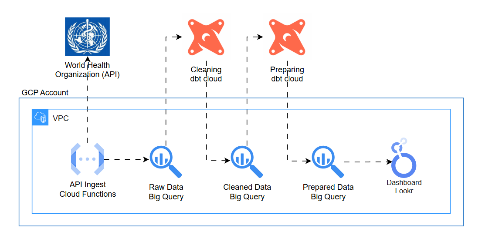

# WHO Analytics Engineering Project

## Architecture

## Summary
This project implements an end-to-end analytics engineering pipeline using data from the World Health Organization (WHO) Global Health Observatory OData API.  
The goal is to ingest raw health indicators, clean and standardize them using dbt, model them following a medallion architecture, and expose curated gold-layer datasets to BI tools.

## Architecture Trade-offs

### BigQuery as Storage and Processing
- Direct ingest into BigQuery reduces components and simplifies maintenance.  
- Suitable for semi-structured WHO API payloads (JSON).  
- Eliminates need for intermediate GCS storage, which would add latency and cost.

### Cloud Functions for Ingestion
- Ideal for scheduled API extraction.  
- Lightweight and inexpensive for low-volume, periodic WHO API calls.  
- Dataflow not used because no heavy parallelism or streaming processing is required.

### Data Profiling Before dbt
- Initial local profiling (e.g., Pandas) helps understand schema, data types, null patterns, and quality issues.  
- After profiling, transformations and tests are formalized in dbt (modeling + automated quality checks).  
- Matches standard analytics engineering workflow.

### Medallion Architecture (Bronze → Silver → Gold)
- **Bronze:** raw JSON from API, minimally processed.  
- **Silver:** cleaned and standardized tables, ensuring consistent types and normalized columns.  
- **Gold:** final analytical layer with dimensional/star-schema models for BI consumption.  
- Star schema placed only in the gold layer for clarity, performance, and reusability.
